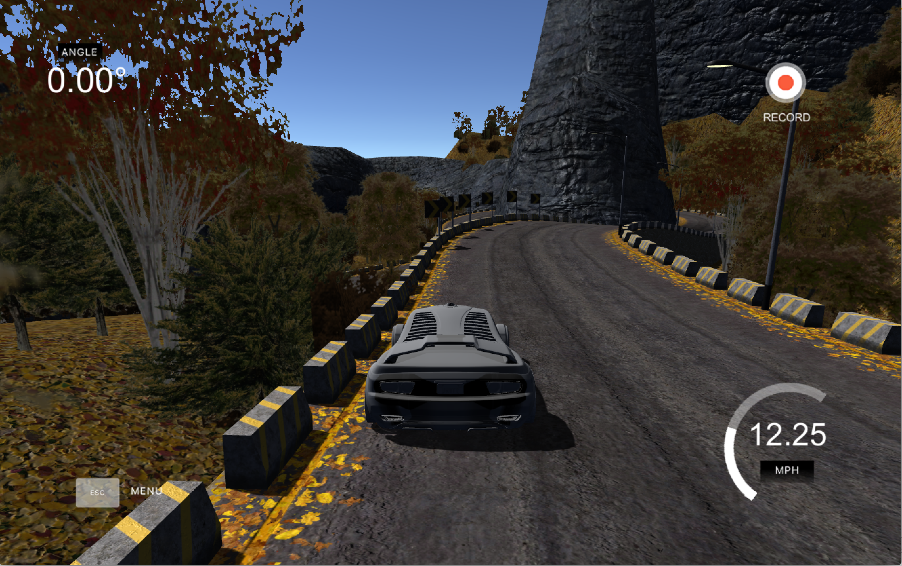
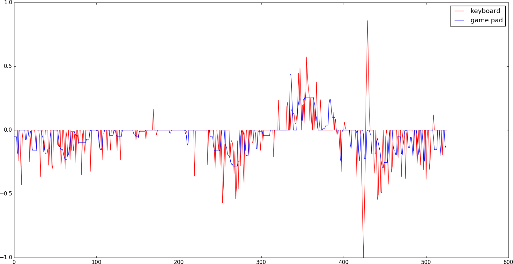
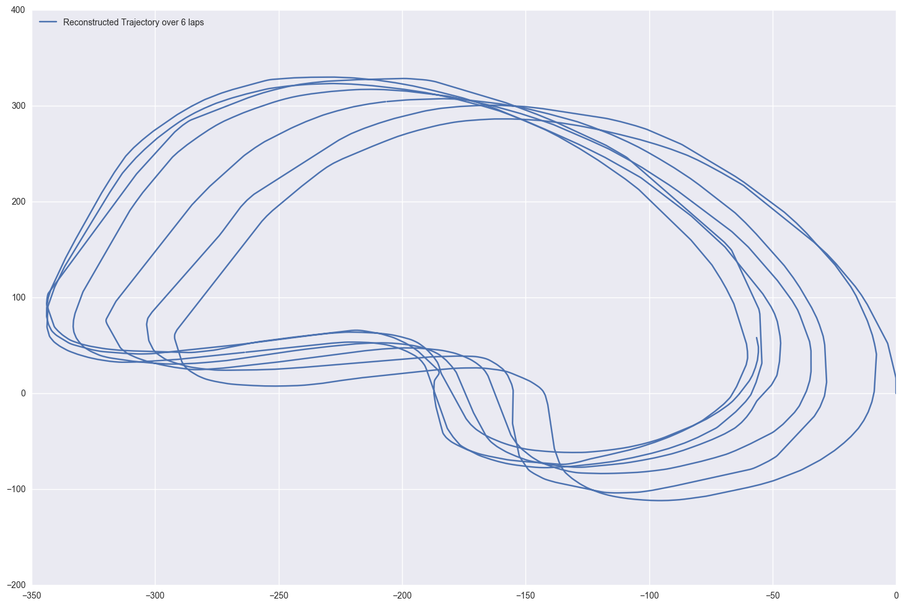
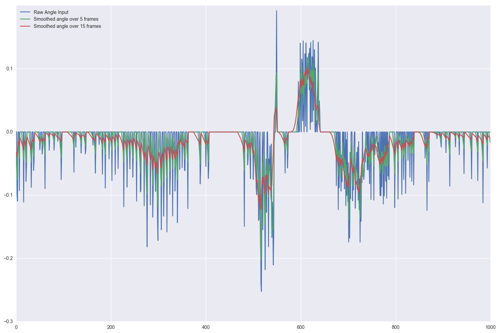
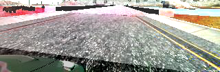
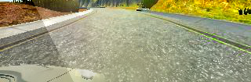
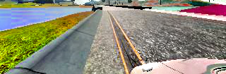
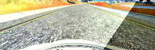
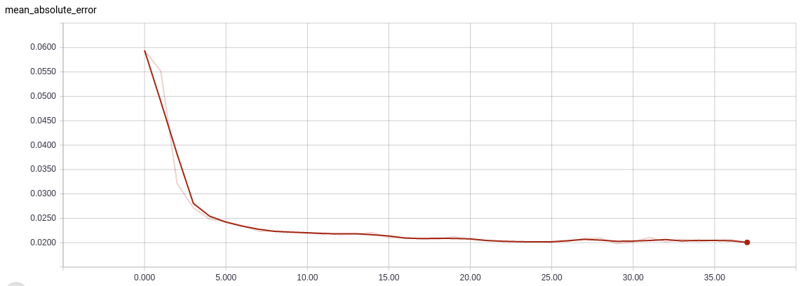
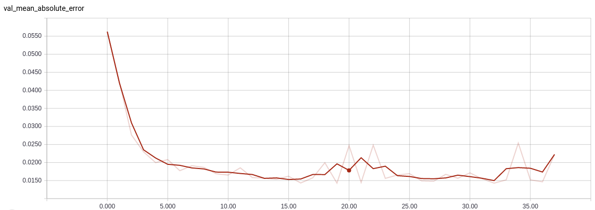

# Udacity Self Driving Car Nanodegree - Behavioral Cloning

Third project of the Udacity Nanodegree, and until now, the most challenging and fun one! What is this about? Basically, re-implement a simple version of the recent [article](https://arxiv.org/pdf/1604.07316v1.pdf) from Nvidia research team who described a neural network being able to perform end-to-end learning on self-driving cars.

For that purpose, the Udacity team designed a simple simulator which let us acquire data (i.e. cameras, steering angle, speed and gas) and then test our self-driving solution.

## Project Overview

Here are the main files constituting the project:
* `model.py`: Contains the model description (using Keras) and the basic code necessary for training;
* `drive.py`: Mainly Udacity code. Used to send the steering and gas commands to the simulator in self-driving mode. Just added some simple pre-processing to input image (normalization and cropping).
* `convert_img_to_data.py`: (Long) source in charge of pre-processing the steering data provided by the simulator. It generates as output training data in numpy format (.npz files).
* `image_processing.py`: Custom improvements over the Keras implementation of the class `ImageDataGenerator`: I have added data flipping (image + steering angle) and additional color augmentation (random modification of contrast, brightness and saturation of input images).
* `random_surfaces.py`: Generation of custom random surfaces which improve over the classic data augmentation.

## Dataset pre-processing and augmentation

As a main dataset for training the network, I used the following data from **Track 1 only**:
* 6 normal laps;
* 6 normal counter-clock laps;
* 3 laps recovering from the left-side of the track;
* 3 laps recovering from the right-side of the track.

To generate the latter two datasets, I selected the simulator frames with only positive (resp. negative) angles as they constitute the relevant data for simulating recovery. Overall, the training dataset was around 6GB of data.

### Angle pre-processing

The pre-processing component of the previous dataset happened to be the most challenging part, partially due to my computer set-up. Like a few other students, I could only use my keyboard to drive and generate data on the simulator. As many have experienced, keyboard and game pad generate very different types of steering data, as shown by in the following graph (courtesy of Patrick Kern on Slack):

The keyboard output is clearly much more noisy and sparse compared to the smooth game pad signal. The former looks a lot like an impulse graph: most values are zeros whereas the remaining ones are large pulses. As one may easily guess, this type of signal makes the training procedure much more challenging, and often leads to a neural network being stucked during training in a non-optimal local minimum (typically, a constant steering angle).

Hence, I spend quite some time and effort trying to improve the steering angle data (even though far more time consuming, I found intellectually more challenging and interesting than buying a cheap Game Pad on Amazon !). A naive and simple approach to this problem could be to simply apply some smoothing filtering on the steering data (typically, exponential smoothing). As I discovered, the main problem with this simple solution is that the smooth output data does not necessarily make sense in terms of car physics. Namely, if one replace a one-pulse angle by an average over 5 or 10 frames, the car will not end up at the same position after these 5 / 10 frames. The physical system is clearly non-linear! In addition, for this type of model, one would prefer a so-called **zero-lag** filter: namely, a filter which reacts instantaneously to a new situation.

Consequently, one needs a more advanced strategy to tackle this smoothing problem. Inspired by the Nvidia team work, I decided to take a more scientific and physical approach. The data provided by the simulator (steering angle, speed and frame rate) allows to re-construct (up to a certain precision) the trajectory of the car using known car physics (see this [page](http://www.asawicki.info/Mirror/Car%20Physics%20for%20Games/Car%20Physics%20for%20Games.html) for a reference on the topic). The algorithm, described in the function `trajectory` in the file `convert_img_to_data.py` is not very complex: for every frame, the angle allows to deduce the turning radius and displacement vectors, thus the next position. Updating the rotation matrix with this data, one can repeat this operation and obtain a re-construction of the trajectory.

As one can see on the picture above, the reconstruction is not perfect. If ones can recognise the shape of the track, the different laps do not overlap perfectly. There is a simple explanation for this error accumulating lap after lap: I used a very simple physical model to simulate the car turning, which is only realistic at very low speed (as it does not take into account the momentum of the car), and thus does not match completely the more advanced model integrated in the simulator.

The good news is that obtaining only an approximate trajectory does not matter to us! In order to smooth the steering angle, one only needs to a good local approximation of the trajectory. Indeed, we obtain a smoothed angle output by looking at a time horizon of around 10 frames (i.e. 1 second) and then compute the proper steering angle to be at this position after these 10 frames. Anticipating the car movement over a second allows to smooth the steering angle, and remove the pulse behaviour typical of the keyboard output (which is basically a 1 frame anticipating scheme).

More specifically, we tried two different methods to compute the smoothed steering angle:
* Using the [curvature](https://en.wikipedia.org/wiki/Curvature) of the trajectory over 1 second period (implemented in the function `angle_curvature`);
* Calculating the steering angle using two data points (0 and 10 frames) and the car direction (implemented in the function `angle_median`).

If we observed that the first method gave a smoother steering estimate, the latter makes more sense physically, and thus led to better training of the neural network.

As we can observe, our smoothing methodology led a massive improvement of the steering data. Note the choice of the time period (between 5 and 20 frames) is a compromise between smoothing the signal and obtaining a realistic angle for controlling the car (one easily understand that calculating an angle over a period of 20 seconds gives very smooth data but does not make sense!). In our case, we decided to settle for 10 frames (i.e. 1 second) to compute the smoothed angle. It seems indeed quite realistic that the road seen by the driver is enough to anticipate the trajectory for the next second.

It may sound like a very complicated procedure for not much at the end (what! All this work for a bit of smoothing!). Well, in fact, it is not only about smoothing! The main advantage of the previous computation is to allow the implementation of a data augmentation technique described in the Nvidia article. Namely, the biggest problem with training an end-to-end solution is that it must not only learn how to drive in the middle of the road, but also understand how to recover onto the center from the side of the road. And for the latter to append, one needs large amount of recovery data. One strategy is to simulate this recovery by waving on the road. Another one, as described in the Nvidia work, is to use left and right cameras to simulate an off-track trajectory, and teach the network to recover from it. The great news is that our simulator generate for us these left and right cameras outputs! And our algorithm can generate very simply the recovery steering angle, since the left and right view points simply correspond to an offset of the initial position. Hence, in addition to smoothing steering angle data, our method also us to generate large amount of recovery data, which is strategic to train a robust model.

### Additional data augmentation

In addition to our complex angle pre-processing pipeline, we made use of more classic pre-processing techniques. The latter transforms were all computer during training, using a custom implementation of the Keras class `ImageDataGenerator`.
* Horizontal flip of images: to counter the left-turn bias of the dataset, we randomly flip images during training. Of course, for this transform to make any sense, we also flip the steering angle accordingly!
* Random contrast, brightness, saturation and hue (implemented in `image_processing.py`). This transformation aims to make the network more robust to modification of the road light and color. The implementation is directly inspired by the corresponding methods available in the TensorFlow library, but instead of chosing a uniform random factor over the full image, I generate a complete random surface which allows the transform to change from a pixel to another.
* Image cropping: I decided to cut the 15 pixels bottom and 50 pixels top on input images. These parts do not provide any information on most images (landscape or full road usually), and cropping reduce the side the network and number of parameters, and thus can help training.

The combination of the previous data augmentation techniques generates the following sort of images:

## Network architecture

As previously presented, the network architecture I used is highly inspired by the work of the Nvidia team on end-to-end driving. Namely, I used the following convolutional network:

| Layer type |  Size | Stride | Padding  | Dilation | Output Depth | Output Height x Width |
|----------|:-------------:|:------:|:------:|:------:|:------:|:------:|
| Normalisation     |  1x1 | 1 | -  | - | 3 | 105x320 |
| Convolution     |  5x5 | 2 | VALID  | - | 24 | 51x158 |
| Convolution     |  5x5 | 2 | VALID | - | 36 | 24x77 |
| Convolution     |  5x5 | 2 | VALID | - | 54 | 9x37 |
| Convolution     |  5x5 | 1 | VALID | - | 54 | 6x33 |
| Convolution     |  3x3 | 1 | VALID | - | 64 | 4x31 |
| Convolution     |  3x3 | 1 | VALID | - | 80 | 2x29 |
| Flatten     | -    | - | - | - | - | 4640 |
| Dropout p=0.5     | -    | - | - | - | - | 4640 |
| Fully Connected     |  - | - | - | - | - | 100 |
| Dropout p=0.5     | -    | - | - | - | - | 100 |
| Fully Connected     |  - | - | - | - | - | 50 |
| Fully Connected     |  - | - | - | - | - | 10 |
| Fully Connected     |  - | - | - | - | - | 1 |

Every convolution layer in the network is followed by a Batch Normalisation layer in order to help training speed, and a ReLU activation layer. Fully Connected layers are followed by PReLU activations (see this [paper](https://arxiv.org/abs/1502.01852)) in order to prevent dead neurons to appear during training (neurons with constant zero output). A more classic ELU activation function also prevents this downside. Note that by essence, Batch Normalisation layers do not need to be followed by PReLU/ELU activations (the normalisation forcing the activation of the output for certain values).

There are only very few modifications compared to the original Nvidia paper. Since my input image was slightly larger, I decided to add an additional 3x3 convolution layer. Furthermore, I also decided to increase slightly the depth of every layer. Overall, the network still has a very similar architecture, and in particular, remains light enough to be run in real time in simulation (or reality within a couple months!).

Note that I did not try transfer learning on this project. I did not seem appropriate to me as the network has to learn a very specific task quite different from classification tasks on which deep networks such as VGG / Inception / ResNets are trained for. Comments on Slack from students who tried it tend to corroborate this observation.

## Training

Due to the noisy steering angle data, the training has been quite challenging. Of course smoothing the data helped a lot for getting better results. In addition to that, we use more classic regularization procedure to obtain a more robust model: dropout and L2-regularisation of weights (both convolutional and fully connected layers). More specifically, here are the hyper-parameters I ended up choosing:
* Optimizer: Adam. The latter seems quite common in the nowadays literature, being quite robust.
* Loss function: Mean Squared Error, the usual suspect for regression tasks!
* Batch size: 16. It appeared that smaller batch sizes help the training, avoiding being trapped in local minima (typically, 32 or 64 would lead to a constant steering angle output). As it is known, this parameter is always a trade off between the gradient regularisation of higher batch size, and the stochastic effect of smaller sizes which helps avoiding local minima. Note that even batch sizes of 4 or 8 happened to work well in the case of this project.
* Learning rate: 0.0001. Similarly, it seems to be the optimal trade-off between a large initial decrease of the loss function, and the final loss after 20 epochs of training. We use a polynomial decay of this learning rate, with a constant rate of 1e-6.
* Epochs: 10, and then 30. We experimented most of the architectures and hyper-parameters on 10 epochs, and then, after selecting optimal values, we fine tuned the network over 30 epochs. The latter fine-tuning happened to be valuable for regularizing the network and obtain a more robust model.
* L2-regularisation weights: 1e-5. Similarly, quite a standard value, helping regularization of fully connected layers without putting too much emphasized on it at beginning of training.

The dataset was split into 90% for training and 10% for validation. As you can observe on the following graph, the regularization aspect is clear on the validation curve, as very little over-fitting appears during training (even though the validation curve is more noisy, it always stays under the training curve).

## Results

On a quantitative level, the previous graph clearly displays a good training profile: constant decrease of the loss function on both the training and validation datasets. In addition, we also computed the Mean Absolute Error, which is more physically interpretable: at the end of training, the latter is around 0.02 radians (around 1.1 degrees), which is an acceptable error margin for a driver!

On a more qualitative level, we experimented the final model on the tracks 1 and 2. Note that the tests were made using the **highest graphic setting**. In addition, I multiply the output of the network by a constant factor 1.5. This is due to the fact that the simplified physical model used to pre-process that steering angle tends to under-estimate the real angle by not considering the inertia of the car, and thus the output given by the network has a similar flaw. The determination of this factor is purely experimental, even though we observed that any value between 1.3 and 2. happens to be working fine (larger values then tend to favoritize an oscillating behavior of the car). The models data is available in the `checkpoints` directory. More precisely, I left the results of two trainings:
* a smooth model, behaving very well on the first track, but which unfortunately does not generalize very well to the second one;
* a robust model, which generalizes much better, but tend to have a rougher behavior due to the training parameters used (less steering angle smoothing)/

On the first track, the first model behaves well, performing smooth turns and staying on the middle trajectory most of the time. In addition, it recovers properly when the car happens to side-track a bit. The second one is also working fine, even though not as smooth.

A more interesting experiment was of course to test the network on the second track, which was **not used in training**. Such a test clearly shows if the neural generalizes well to other environment and learnt the correct features of a road, or if it only happened to learn "by heart" the good trajectory on the first track. Interestingly, the second model performs quite well on Track 2, being able to turn correctly at full speed on almost the complete track. For sure, the behavior is not as smooth than on track 1, which can be expected as Track 2 is more challenging in terms of trajectory. In addition, the more erratic behaviour is also due to the initial keyboard input which does not to generate recovery data as smooth as a game pad. 

I think a major improvement could come from simply using a game pad and thus obtain better quality data. I think my present data augmentation pipeline and the neural network combined with improved data could lead to a very robust and smooth behaving self-driving model!

